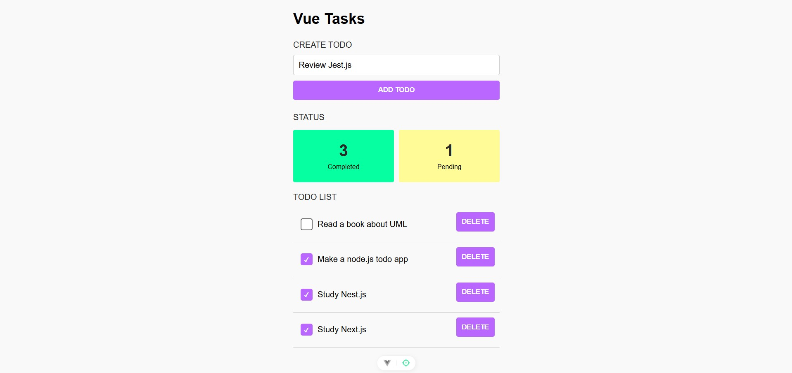

# Vue.js Todo List

A simple and user-friendly Todo List application built with Vue.js. This project focuses on a pleasant user interface and smooth usability to help manage daily tasks efficiently.

Features:
- ✅ Add tasks  
- ❌ Delete tasks  
- ✔️ Mark tasks as completed  
- 🔃 Sort tasks  

Technologies used:
- Vue.js  
- JavaScript  
- CSS (BEM methodology)  

Requirements:
- Good user experience  
- Clean and attractive user interface  

